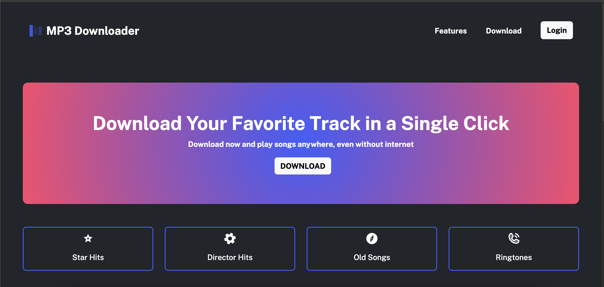

# Project Title

Landing page for MP3-Downloader - UI -HTML CSS Bootstrap

## 🚀 Features

1. Dowload songs instantly.
2. Download songs by category.
3. Download andn listern songs anywhere , even if you are in offline

UI point of view I focused on ,

- Build a landing page for MP3 Downloader application.
- Implement the responsive layout using Bootstrap layouts
- Website to be responsive to Mobile, Tablet, Desktop
- Use bootstrap utility classes
- Deployment

Technology: HTML, CSS, Bootstrap

How did I approached UI:

- Research:
  Inspired with lot of designs by google search, Referring the music apps and come up with my own ideas. With the UXUI designing knowledge , I try to focus overall look, font , colour, arrangement of elements that allows user to scan card easily.

- Wireframe:
  Sketching the basic idea on Figma including header, main-hero section, feature section, category and footer section.

- Components design:
  Designed nav links, cards, accordion using Bootstrap classes for consistent layout.

- Colour and font
  using color palette and font "public-sans" to improvise the readability and visually appeal.

- UI Design
  Build a responsive landing page for mp3 downloader app .
  Used bootstrap classes for layout structure and styling the components to focus on easy navigation and guide the user effectively.

Tools Used
• VSCode for coding and Live Preview plugin
• Netlify
• Github

Challenges faced:

## 💻 Technologies Used

- HTML
- CSS
- Bootstrap
